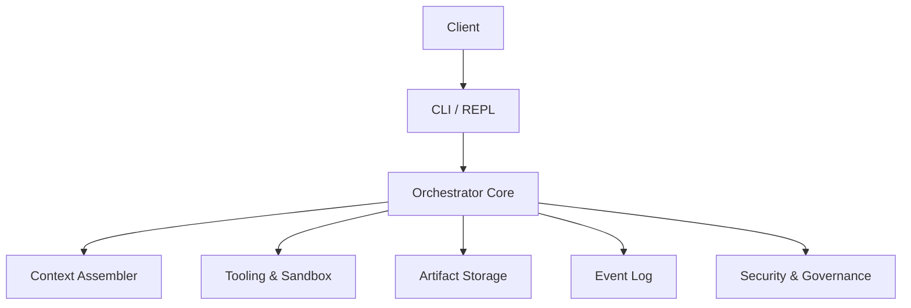

<!-- SPDX-License-Identifier: MPL-2.0 -->
# LLM Orchestrator

A high-performance orchestration framework for managing multi-agent LLM workflows with fine‑grained control over context, tooling, and resource allocation.

## Features

- **Context Management**: Intelligent context assembly with token budgeting
- **Tool Versioning**: Semantic versioning for tools with migration support
- **Cost Control**: Real-time cost monitoring and budget enforcement
- **Sandboxed Execution**: Secure, isolated execution environments
- **Structured Artifacts**: Type-safe data passing between components
- **REPL Interface**: Interactive debugging and control

## Architecture



See [Architecture Overview](docs/architecture_overview.md) for a detailed component guide.

## Roadmap: Hardening the Orchestrator

- **Deterministic Semantics**: Conversations, tool calls, and state updates are captured as typed events with content hashes, causal clocks, and provenance so runs can be replayed bit‑for‑bit.
- **Supply Chain Provenance**: Tools, prompts, and policies will ship with SLSA/in‑toto attestations and signature verification to ensure only trusted artifacts execute.
- **Layered Safety**: Sandboxed code executes in isolation tiers (e.g., Docker, LXC, gVisor) with AST‑level restrictions and network egress guards; isolation overhead is measured and documented.
- **Economic Governance**: A resource‑aware scheduler enforces token and cost budgets per step, enabling dynamic model selection, caching policies, and cost‑aware routing.
- **Notebook Replay**: Each workflow can export a replay bundle with inputs, seeds, and provenance to support deterministic local or CI reproduction.

## Installation

1. Clone the repository:
   ```bash
   git clone https://github.com/yourusername/llm-orchestrator.git
   cd llm-orchestrator
   ```

2. Bootstrap the project toolchain (creates `.venv/`, installs dependencies, and configures hooks):
   ```bash
   make bootstrap
   ```

## Quick Start

```python
from orchestrator.context.assembler import ContextAssembler, ContextBudget

# Initialize the context assembler
assembler = ContextAssembler()

# Define your messages and budget
messages = [
    {"role": "system", "content": "You are a helpful assistant."},
    {"role": "user", "content": "Hello, how are you?"}
]

budget = ContextBudget(max_tokens_in=1000)
provider_caps = {"max_tokens": 4000, "max_input_tokens": 4000, "max_output_tokens": 1000}

# Assemble the context
context = await assembler.build(
    messages=messages,
    provider_caps=provider_caps,
    budget=budget
)
```

## Running Tests

```bash
make test
```

## Repository Structure

```
.
├── CHANGELOG.md
├── CODE_OF_CONDUCT.md
├── CONTRIBUTING.md
├── Makefile
├── README.md
├── docker-compose.yml
├── docs/
│   ├── advanced_architecture.md
│   ├── architecture_overview.md
│   └── adr/
│       └── 0001-repository-structure.md
├── scripts/
│   ├── bootstrap                # Set up virtualenv, tooling, and hooks
│   ├── check                    # Run the full validation suite
│   ├── fmt | lint | typecheck   # Formatting and static analysis
│   ├── test | e2e | coverage    # Test execution helpers
│   ├── build | package | release
│   ├── update-deps | security-scan | sbom
│   ├── dev                      # Optional hot-reload test loop
│   └── powershell/              # Windows equivalents of the toolbelt
├── src/
│   └── orchestrator/            # Core Python package
├── tests/
│   ├── unit/                    # Unit tests mirroring src/
│   ├── integration/
│   ├── e2e/
│   └── fixtures/
├── infra/
│   └── docker/Dockerfile        # Container definition for local/CI parity
├── sbom/                        # Generated Software Bill of Materials
├── configs/                     # Runtime configuration assets
├── assets/                      # Design and media assets
├── data/                        # Sample datasets (kept empty by default)
└── project.yaml                 # Machine-readable metadata
```

## Developer Tasks

All day-to-day automation is exposed through the scripts in `scripts/` and mirrored by
Make targets:

| Task | Description |
| ---- | ----------- |
| `make bootstrap` | Create a virtual environment, install dependencies, and configure pre-commit hooks. |
| `make dev` | Run the unit test suite with optional hot-reload (`WATCH=1`). |
| `make fmt` / `make lint` | Format code with Black/isort/Ruff and run static analysis including Bandit. |
| `make typecheck` | Execute `mypy` in strict mode. |
| `make test` / `make coverage` | Run unit tests with coverage reports and thresholds. |
| `make e2e` | Execute end-to-end scenarios when present. |
| `make build` / `make package` | Produce Python distributions for release. |
| `make security-scan` | Perform dependency, code, and secrets scanning. |
| `make sbom` | Generate a CycloneDX SBOM at `sbom/sbom.json`. |
| `make update-deps` | Regenerate pinned dependency lockfiles using `pip-tools`. |
| `make gen-docs` | Build the MkDocs documentation site. |
| `make release` | Run `make check`, build artifacts, and validate them with Twine. |
| `make check` | Aggregate formatting, linting, type checking, testing, coverage, and security scans. |

Each script accepts standard flags (e.g., `--fix` for linting) and respects the virtual
environment configured by `make bootstrap`.

## Configuration

Copy `.env.example` to `.env` and update the values as needed:

```bash
cp .env.example .env
```

## License

LLM Orchestrator is distributed under the [Mozilla Public License 2.0](LICENSE).
Modifications to MPL-covered files must be shared under the same license so
that downstream users receive the improvements. Larger works that merely
aggregate or interface with this project may remain under their own
proprietary or open source terms.

For attribution requirements and third-party acknowledgements, review the
[NOTICE](NOTICE) file alongside the detailed [THIRD_PARTY_NOTICES](THIRD_PARTY_NOTICES).

## Credits

LLM Orchestrator is maintained by Augusto "Guto" Ochoa Ughini and the
community of contributors. See [NOTICE](NOTICE) for project attribution and
[THIRD_PARTY_NOTICES](THIRD_PARTY_NOTICES) for bundled dependency licenses.
