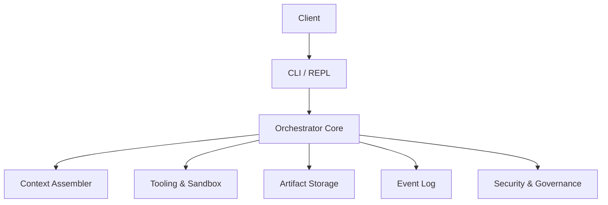

# LLM Orchestrator

A high-performance orchestration framework for managing multi-agent LLM workflows with fine‑grained control over context, tooling, and resource allocation.

## Features

- **Context Management**: Intelligent context assembly with token budgeting
- **Tool Versioning**: Semantic versioning for tools with migration support
- **Cost Control**: Real-time cost monitoring and budget enforcement
- **Sandboxed Execution**: Secure, isolated execution environments
- **Structured Artifacts**: Type-safe data passing between components
- **REPL Interface**: Interactive debugging and control

## Architecture



See [Architecture Overview](docs/architecture_overview.md) for a detailed component guide.

## Roadmap: Hardening the Orchestrator

- **Deterministic Semantics**: Conversations, tool calls, and state updates are captured as typed events with content hashes, causal clocks, and provenance so runs can be replayed bit‑for‑bit.
- **Supply Chain Provenance**: Tools, prompts, and policies will ship with SLSA/in‑toto attestations and signature verification to ensure only trusted artifacts execute.
- **Layered Safety**: Sandboxed code executes in isolation tiers (e.g., Docker, LXC, gVisor) with AST‑level restrictions and network egress guards; isolation overhead is measured and documented.
- **Economic Governance**: A resource‑aware scheduler enforces token and cost budgets per step, enabling dynamic model selection, caching policies, and cost‑aware routing.
- **Notebook Replay**: Each workflow can export a replay bundle with inputs, seeds, and provenance to support deterministic local or CI reproduction.

## Installation

1. Clone the repository:
   ```bash
   git clone https://github.com/yourusername/llm-orchestrator.git
   cd llm-orchestrator
   ```

2. Create and activate a virtual environment:
   ```bash
   python -m venv venv
   source venv/bin/activate  # On Windows: .\venv\Scripts\activate
   ```

3. Install dependencies:
   ```bash
   pip install -r requirements.txt
   ```

## Quick Start

```python
from orchestrator.context.assembler import ContextAssembler, ContextBudget

# Initialize the context assembler
assembler = ContextAssembler()

# Define your messages and budget
messages = [
    {"role": "system", "content": "You are a helpful assistant."},
    {"role": "user", "content": "Hello, how are you?"}
]

budget = ContextBudget(max_tokens_in=1000)
provider_caps = {"max_tokens": 4000, "max_input_tokens": 4000, "max_output_tokens": 1000}

# Assemble the context
context = await assembler.build(
    messages=messages,
    provider_caps=provider_caps,
    budget=budget
)
```

## Running Tests

```bash
pytest tests/ -v
```

## Project Structure

```
llm-orchestrator/
├── orchestrator/
│   ├── context/           # Context management and assembly
│   ├── models/            # Data models and schemas
│   ├── tools/             # Tool definitions and registry
│   ├── artifacts/         # Artifact storage and management
│   ├── sandbox/           # Sandbox execution environments
│   └── prompts/           # Versioned prompt templates
├── tests/                 # Test suite
├── .env.example          # Example environment variables
├── requirements.txt      # Python dependencies
└── README.md            # This file
```

## Configuration

Copy `.env.example` to `.env` and update the values as needed:

```bash
cp .env.example .env
```

## License

Proprietary - All Rights Reserved

This project is proprietary and confidential. Unauthorized copying,
modification, distribution, or use is prohibited without prior
written consent from the author.
